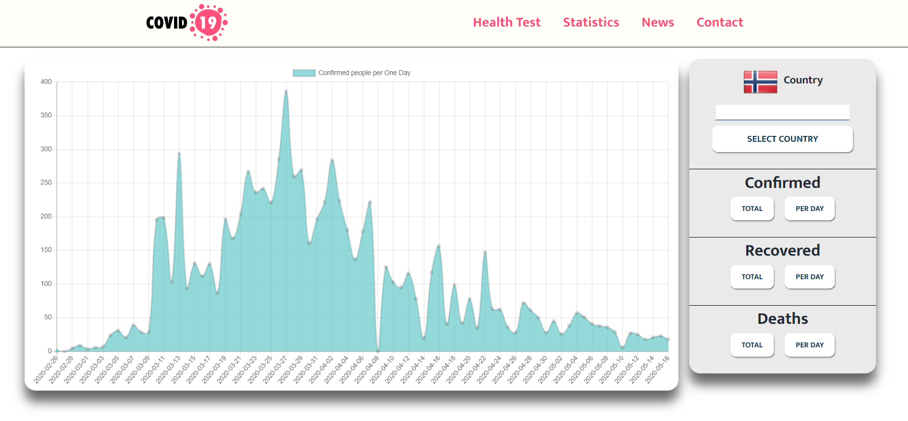
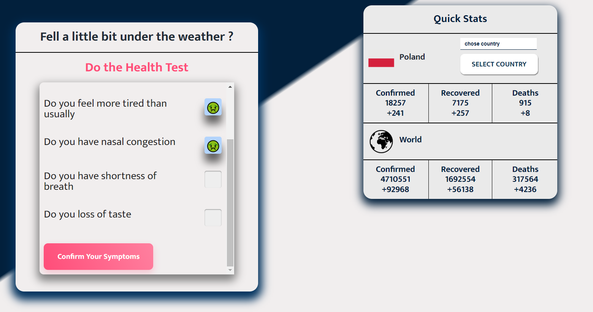
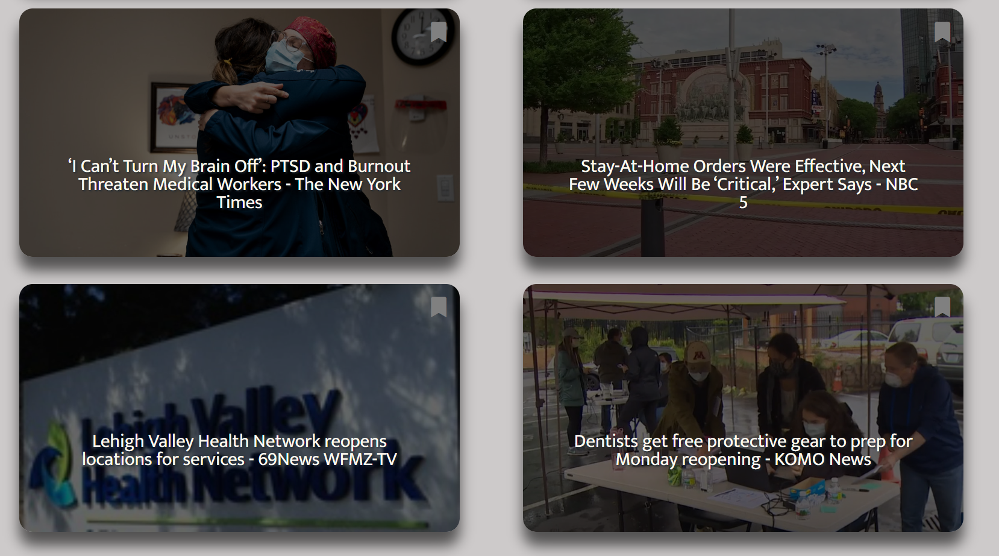

# Covid-19 
Welcome to Covid-19 ! I built this application because I wasn't 
able to find any responsive place when I can find out just basic informations
about this virus. Only pages with large amounts of ads and you need to scroll
over it more than 30 minutes end of endings you know nothing :(

## Description of Application

**Covid-19** is an application when you can check your chance to be carrier
of Covid-19. Also you can check some statistics about confirmed,recovered or deaths people 
globaly or locally if you wanna a little bit more precise statistics you can
click chose in nav Section Statistics where you can find big chart with a few options
. If you wanna to check some news there we go . App will find only 
informations associated with Covid-19. At the end you can also fill out the contact form
if you fill really bad to contact with your goverment.

###DEMO
Statistics

Health Test and Quick Stats

Form

News

## Setup
How to start:

To start development follow this instruction:

* `clone` this repo
* `npm install` all necessary npm packages
* `npm start` project
* `npm run rest` to start you local json server (after completing the form personal details will add to the json server)

## Technologies
* React
* React Router
* ES6
* SASS
* HTML 
* JSON Server
* fetch
 
 ## Contact
 Created by Piotr Śliwka. Feel free to contact me! 
